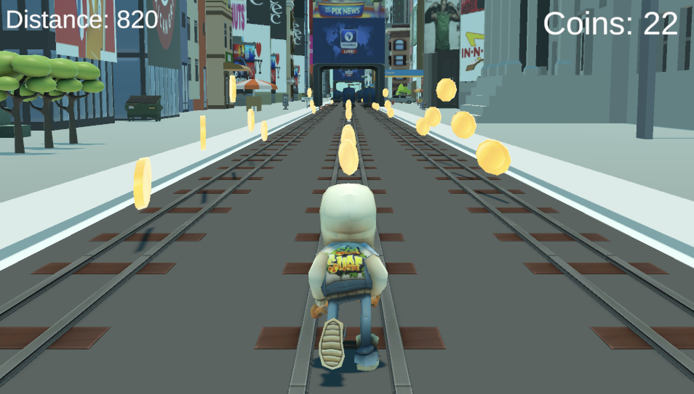
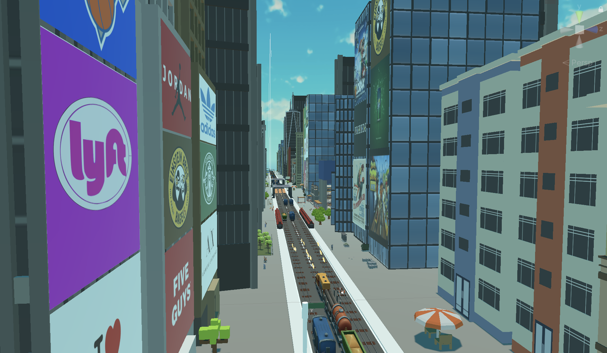

# Subway-Surfers-Remake
This project is a 3D endless runner game remake of Subway Surfers, created as a capstone project endeavor to deepen my understanding of game development using Unity. Throughout the project, I applied object-oriented programming principles in C# to structure gameplay mechanics, while leveraging Photoshop and Blender to design custom models, textures, and visual elements. I also utilized Unity’s Animator to smoothly integrate character movements and transitions. Altogether, this remake served as an immersive learning experience, helping me refine my skills in software architecture, visual design, and interactive animation within a Unity-based pipeline.

This code is viewable for reference only and cannot be copied, modified, or redistributed without explicit permission.

All files of project can be shared upon request. 

img width="1440" height="900" alt="Screenshot 2025-08-22 at 10 18 13 AM" src="https://github.com/user-attachments/assets/c83bf382-9bc8-4d25-8105-8975fed6ac98" />

